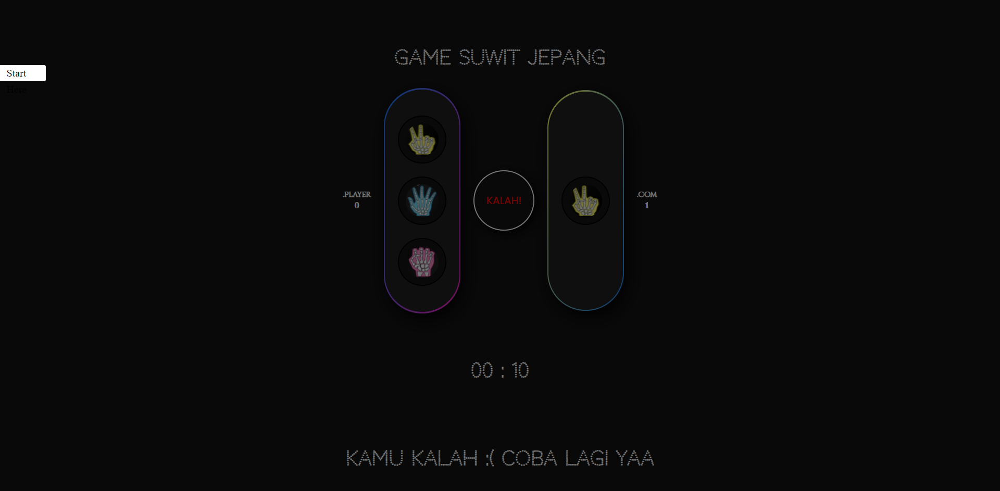
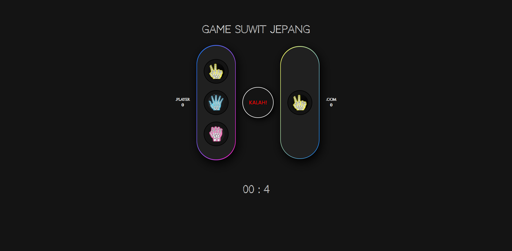

## Game Suwit Jepang

## Apa dan Tujuan

Ini merupakan _game_ suwit jepang sederhana hasil ATM ( **A**mati **T**iru **M**odifikas) dari salah satu vidio di _channel_ Web Programming Unpas yaitu [MEMBUAT GAME SUWIT JAWA DENGAN JAVASCRIPT](https://www.youtube.com/watch?v=Mmf3SXHifBw) yang membuat dan menjelaskan bagaimana membuat _game_ suwit jawa sederhana dengan hanya menggunakan HTML, CSS, dan Javascript.

Pembuatan _game_ ini bertujuan untuk mengasah logika pemrograman dan bagaimana menyelesaikan suatu permasalahan, khususnya pada bahasa pemrograman Javascript. _Game_ ini juga mencakup materi - materi penting dasar - dasar Javascript, seperti :

-   _Event Listener_
-   _Set Timeout_
-   Manipulasi _attribute_

## Teknologi yang digunakan

-   Html
-   Css
-   Javascript

## Fitur

-   Repsonsif pada semua ukuran _device_

## Screenshot

